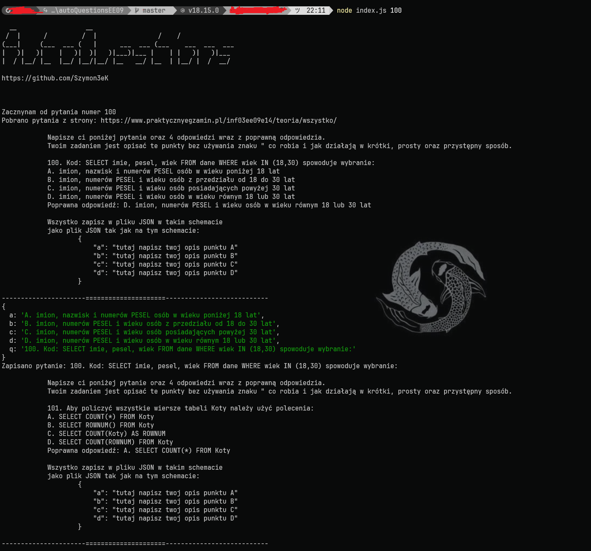
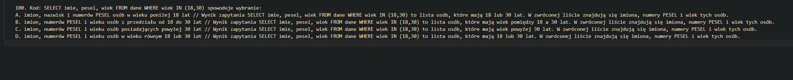

# autoQuestionsEE09
Latwy skrypt do rozwiazywania pytan
Link odrazu do rozwiazanych pytan: https://github.com/Szymon3eK/autoQuestionsEE09/blob/master/output/answers.txt
# Jak uzywac?
1. pobierz to repo
2. Odpal cmd
3. Wpisz npm i (jezeli nie masz node.js to zainstaluj)
4. po zainstalowaniu bibliotek, odpal skrypt komenda node index.js (pytanie od ktorego zaczynamy rozwiazywac)
5. Ciesz sie pytaniami!

# Screeny

